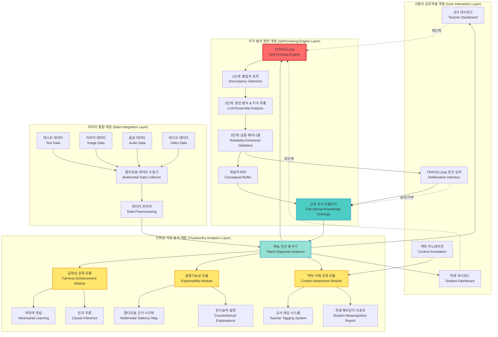
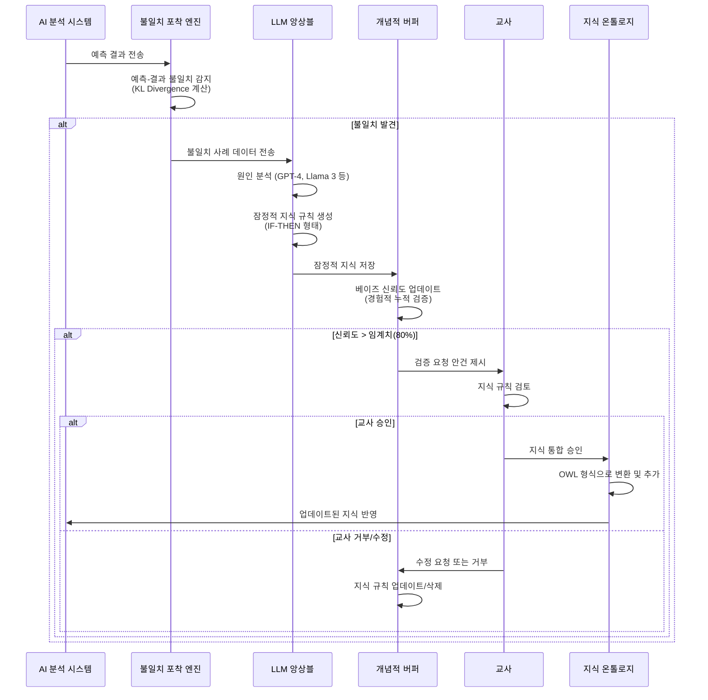
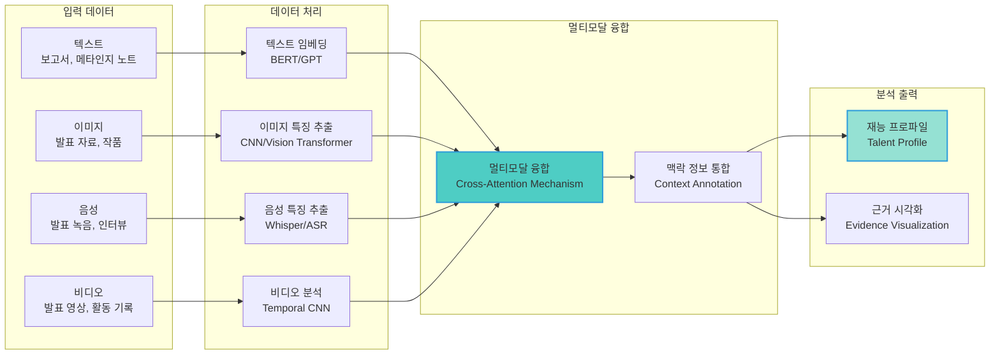

# TEROS 멀티모달 Agentic AI System 아키텍처

## 전체 시스템 구조도

## TEROS-Loop 상세 구조

## 멀티모달 데이터 처리 파이프라인

## 기술 스택 및 구성 요소

### 백엔드
- **AI 모델**: PyTorch, Transformers (Hugging Face)
- **LLM**: GPT-4, Llama 3, 경량화 LLM 앙상블
- **비전 모델**: Vision Transformer, CNN
- **음성 처리**: Whisper, ASR 모델
- **데이터베이스**: PostgreSQL, NoSQL (MongoDB - 개념적 버퍼)

### 프론트엔드
- **프레임워크**: React
- **시각화**: D3.js, Chart.js
- **UI/UX**: 교사/학생 대시보드, 멀티모달 근거 시각화

### 온톨로지
- **형식**: OWL (Web Ontology Language)
- **저장소**: RDF Store
- **추론 엔진**: OWL Reasoner

## 핵심 메커니즘

### 1. 공정성 강화 모듈
- **적대적 학습**: 예측 모델과 적대 모델 동시 학습
- **인과 추론**: 도구 변수 분석을 통한 잠재력 추정

### 2. 설명가능성 모듈
- **멀티모달 그래디언트**: Integrated Gradients, Grad-CAM
- **반사실적 설명**: Genetic Algorithm 기반 탐색

### 3. 맥락 이해 강화 모듈
- **교사 태깅**: 구조화된 맥락 정보 입력
- **학생 메타인지**: BERT 임베딩 기반 통합

### 4. TEROS-Loop
- **1단계**: KL Divergence 기반 불일치 감지
- **2단계**: LLM 앙상블 기반 원인 분석
- **3단계**: 베이즈 신뢰도 업데이트 + 교사 심의

